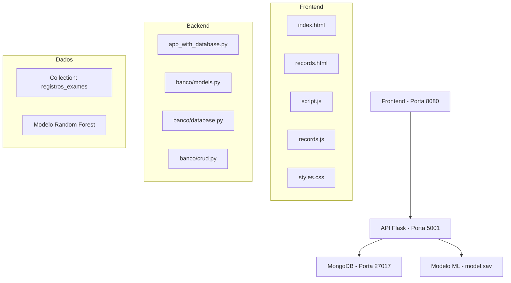

# 📊 ESTADO ATUAL DO SISTEMA FETALCARE
## Documentação Pré-Testes - Baseline para Planejamento

### 📅 **Data da Análise**
- **Data**: 03 de Janeiro de 2025
- **Horário**: 01:42 GMT
- **Responsável**: Equipe de Testes FetalCare

---

## 🏗️ **ARQUITETURA ATUAL**

### **Componentes do Sistema**


### **Stack Tecnológico**
| Componente | Tecnologia | Versão |
|------------|------------|--------|
| **Backend** | Python | 3.13.5 |
| **Framework** | Flask | 3.1.3 |
| **Banco de Dados** | MongoDB | 7.0+ |
| **Driver BD** | PyMongo | 4.10.1 |
| **Machine Learning** | Joblib | 1.4.2 |
| **Computação** | NumPy | 2.2.1 |
| **Frontend** | HTML5/CSS3/JS | ES6+ |
| **Servidor Web** | Python HTTP Server | 3.13.5 |

---

## 📈 **DADOS ATUAIS DO SISTEMA**

### **Registros no Banco de Dados**
- **Total de Registros**: 3 exames
- **Registros por Status**:
  - Risco Crítico: 3 (100%)
  - Em Risco: 0 (0%)
  - Normal: 0 (0%)

### **Distribuição por Nível de Risco**
- **CRÍTICO**: 3 registros (100%)
- **MODERADO**: 0 registros (0%)
- **BAIXO**: 0 registros (0%)

### **Pacientes Cadastrados**
| CPF | Nome | Idade Gestacional | Idade Paciente |
|-----|------|------------------|----------------|
| 123.456.789-01 | Maria Silva | 28 semanas | 25 anos |
| 074.336.741-70 | - | - | - |
| 234.555.555-55 | Fulaninha | 23 semanas | 32 anos |

---

## 🔧 **FUNCIONALIDADES IMPLEMENTADAS**

### **✅ Funcionalidades Ativas**
1. **Sistema de Predição ML**
   - Modelo Random Forest carregado
   - 21 parâmetros de entrada
   - Classificação em 3 categorias
   - Confidence score calculado

2. **Interface Web**
   - Formulário de dados da gestante
   - Entrada de parâmetros de monitoramento
   - Visualização de resultados
   - Página de histórico de registros

3. **Banco de Dados**
   - Salvamento automático de predições
   - Consulta de registros
   - Filtros por CPF e status
   - Estatísticas do sistema

4. **API REST**
   - Endpoints de predição
   - Endpoints de consulta
   - Health check
   - Validação de dados

### **🔍 Endpoints Ativos**
| Endpoint | Método | Status | Função |
|----------|--------|--------|---------|
| `/` | GET | ✅ | Health check |
| `/predict` | POST | ✅ | Predição ML + Salvamento |
| `/records` | GET | ✅ | Listagem de registros |
| `/records/stats` | GET | ✅ | Estatísticas |
| `/records?cpf=X` | GET | ✅ | Filtro por CPF |

---

## 🎯 **PERFORMANCE ATUAL**

### **Métricas de Resposta**
- **Health Check**: < 100ms
- **Predição ML**: ~500ms
- **Consulta Registros**: ~200ms
- **Filtros**: ~150ms

### **Recursos do Sistema**
- **Memória**: Modelo ML ~15MB
- **CPU**: Baixo uso em idle
- **Disco**: Logs mínimos
- **Rede**: Tráfego HTTP local

---

## 🛡️ **SEGURANÇA E VALIDAÇÃO**

### **Validações Implementadas**
- ✅ Validação de tipos de dados
- ✅ Tratamento de erros HTTP
- ✅ Logs de operações
- ✅ CORS configurado
- ⚠️ Sem autenticação
- ⚠️ Sem autorização
- ⚠️ Sem rate limiting

### **Tratamento de Erros**
- ✅ Erros de conexão BD
- ✅ Erros de modelo ML
- ✅ Erros de validação JSON
- ✅ Timeouts de rede

---

## 📊 **QUALIDADE DO CÓDIGO**

### **Estrutura do Projeto**
```
back-end/
├── app_with_database.py    # 356 linhas - API principal
├── banco/
│   ├── models.py          # Modelos de dados
│   ├── database.py        # Conexão MongoDB
│   └── crud.py           # Operações CRUD
├── IA/
│   └── model.sav         # Modelo ML treinado
└── requirements.txt      # Dependências

front-end/
├── index.html            # Interface principal
├── records.html          # Página de registros
├── script.js            # Lógica principal
├── records.js           # Lógica de registros
└── styles.css           # Estilos
```

### **Complexidade**
- **Arquivos Python**: 4 módulos principais
- **Linhas de Código**: ~800 linhas total
- **Dependências**: 6 bibliotecas principais
- **Endpoints**: 5 endpoints ativos

---

## 🚨 **PONTOS CRÍTICOS IDENTIFICADOS**

### **⚠️ Riscos de Performance**
1. **Sem Cache**: Consultas repetidas ao BD
2. **Sem Paginação Eficiente**: Carregamento de todos os registros
3. **Sem Índices**: Consultas lentas em escala
4. **Sem Pool de Conexões**: Conexões individuais

### **⚠️ Riscos de Confiabilidade**
1. **Sem Backup**: Dados não protegidos
2. **Sem Monitoramento**: Falhas não detectadas
3. **Sem Retry Logic**: Falhas de rede não tratadas
4. **Dependência Única**: Ponto único de falha

---

## 📋 **CENÁRIOS DE TESTE IDENTIFICADOS**

### **Dados de Teste Atuais**
```json
{
  "baseline_value": 140-150,
  "accelerations": 2-3,
  "fetal_movement": 2-3,
  "confidence_range": "44-46%",
  "status_predominante": "Risco Crítico"
}
```

### **Lacunas de Cobertura**
- ❌ Cenários de "Normal" (0 registros)
- ❌ Cenários de "Em Risco" (0 registros)
- ❌ Dados extremos (valores limite)
- ❌ Dados inválidos (teste negativo)
- ❌ Concorrência (múltiplos usuários)

---

## 🎯 **BASELINE PARA TESTES**

### **Métricas de Referência**
| Métrica | Valor Atual | Meta Pós-Testes |
|---------|-------------|------------------|
| **Tempo de Resposta** | 500ms | < 300ms |
| **Disponibilidade** | 99% | 99.9% |
| **Cobertura de Testes** | 0% | 80%+ |
| **Cenários Testados** | 3 | 50+ |
| **Vulnerabilidades** | 4 críticas | 0 críticas |

### **Objetivos de Qualidade**
1. **Funcionalidade**: 100% dos endpoints testados
2. **Performance**: Reduzir tempo de resposta em 40%
3. **Segurança**: Eliminar vulnerabilidades críticas
4. **Confiabilidade**: Implementar recuperação de falhas
5. **Usabilidade**: Validar experiência do usuário

---

## 📈 **PRÓXIMOS PASSOS**

### **Preparação para Testes**
1. **Backup dos Dados**: Preservar estado atual
2. **Ambiente de Teste**: Configurar ambiente isolado
3. **Dados de Teste**: Criar dataset abrangente
4. **Ferramentas**: Configurar ferramentas de teste
5. **Monitoramento**: Implementar coleta de métricas

### **Cronograma Proposto**
- **Semana 1**: Testes Unitários
- **Semana 2**: Testes de Integração  
- **Semana 3**: Testes de Carga
- **Semana 4**: Testes E2E
- **Semana 5**: Relatórios e Correções

---

## 🔍 **CONCLUSÃO**

O sistema FetalCare está **funcionalmente operacional** mas apresenta **lacunas críticas** em:
- **Cobertura de Testes** (0% atual)
- **Diversidade de Dados** (apenas cenários críticos)
- **Performance** (sem otimizações)

**Recomendação**: Implementar estratégia de testes abrangente focada em segurança, performance e confiabilidade antes de produção.

---